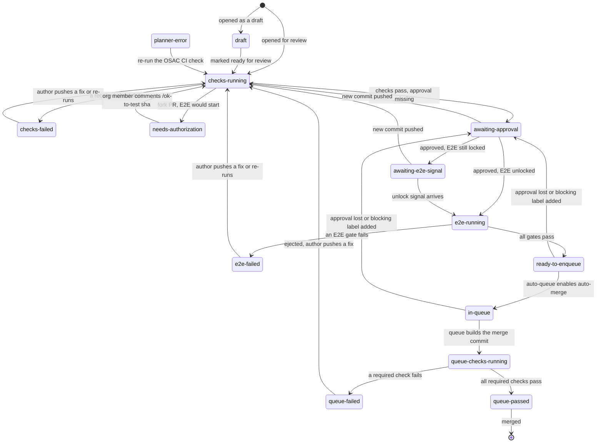
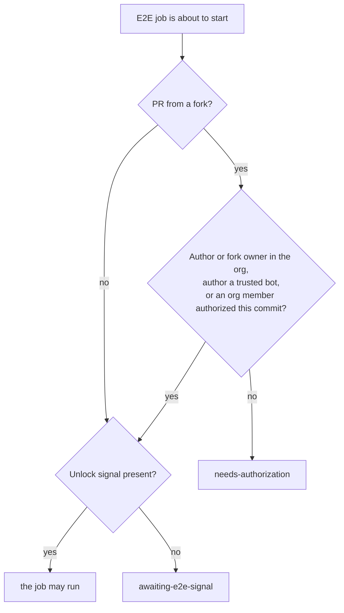

# osac-ci

A policy-driven CI control plane for the OSAC repositories. For any pull request it answers, in one place:
**what is blocking it, why, who must act, and what happens next.**

It reads the live state of a pull request from GitHub (labels, reviews, check runs, changed files, merge queue),
applies a reviewable policy file, and publishes the answer as a check run named **OSAC CI** on the PR, with a
plain-language summary. The same program also explains a PR on the command line, writes a report of every open PR, and
replays history to prove that its answers match what really happened.

Contents: [Background](#background-how-an-osac-pull-request-is-merged) ·
[Concepts](#concepts) ·
[The life of a pull request](#the-life-of-a-pull-request) ·
[Pull request flows by user type](#pull-request-flows-by-user-type) ·
[Components](#components) ·
[Policy reference](#policy-reference) ·
[Operating it](#operating-it) ·
[Security model](#security-model) ·
[Development](#development)

## Background: how an OSAC pull request is merged

OSAC is an open-source platform for sovereign AI infrastructure. Its code lives mostly in one mono-repository,
`osac-project/osac`. Four repositories take part in getting a change merged:

| Repository | Role |
|---|---|
| `osac-project/osac` | The product mono-repo and the main customer of this project. Its workflows run unit tests, linters, integration tests and full-installation (E2E) tests on every pull request. |
| `osac-project/osac-test-infra` | Reusable workflows and actions shared by the E2E suites: slash-command handling, the E2E cost gate, fork handling, the infrastructure backends. |
| `osac-project/github-config` | Terraform for the organization: repositories, teams, branch rulesets and which checks are required. |
| `osac-project/osac-ci` | This repository: the program that decides, from all of the above, whether a pull request may merge. |

Three facts about how `osac` merges explain why a control plane is useful:

1. **Many checks must pass.** A repository ruleset lists about 26 required status checks. Each comes from a different
   workflow, and many are path-filtered: a workflow that has nothing to do reports a skipped or green check.
2. **Approval is a pair of labels.** Reviewers comment `/lgtm` and `/approve`; a bot (Prow) turns those comments into the
   `lgtm` and `approved` labels, and strips `lgtm` again when new commits are pushed. A third label,
   `jira/valid-reference`, shows that the PR points at a Jira issue. A fourth set of labels blocks a merge
   (`do-not-merge/hold`, `do-not-merge/work-in-progress`, `do-not-merge/invalid-owners-file`, `needs-rebase`).
3. **Merging goes through a merge queue.** A script (`auto-queue.sh`) enables auto-merge on a PR whose labels are in
   order. GitHub's merge queue then builds a temporary commit (the base branch plus this PR, plus any PRs ahead of it),
   runs the required checks on it once more, and merges only if they pass. Nobody is forced to use the queue: users with
   enough rights can merge directly, which skips the queue's final check.

Two more things are specific to OSAC:

- **E2E tests are expensive.** A full installation of the platform on real or virtual infrastructure takes about
  100 minutes and costs money. So the E2E jobs do not start on every push: they wait for an *unlock signal* (a human
  `/lgtm`, a `/e2e-ready` comment, or an approval from the CodeRabbit review bot on the exact current commit). The
  required `e2e-*-gate` checks stay *pending*, not failed, until the suites have run.
- **Forks are untrusted.** A pull request from a fork must not read repository secrets or start paid jobs just because
  someone opened it. Members of the organization are trusted. For everyone else a member must say `/ok-to-test`.

The result is that "what is the PR waiting for?" has no single place to look. The answer is spread over labels, review
states, 26 checks and workflow logs. osac-ci computes that answer from one policy.

## Concepts

| Term | Meaning |
|---|---|
| **Snapshot** | Everything the planner may look at for one PR, collected from GitHub: draft flag, author, whether the PR comes from a fork, labels, reviews, check runs, changed files, merge-queue membership. |
| **Policy** | A YAML file (`policy/*.yml`) that lists the jobs that must pass, the labels that gate a merge, how approval works, who is trusted and which signals unlock E2E. Reviewed like code. |
| **Job** | One required check described in the policy: its check name, whether it is a cheap check or a costly E2E suite, which files make it apply. |
| **Planner** | A pure function `plan(snapshot, policy, mode)` that returns a verdict. It does no I/O, so the same input always gives the same answer. |
| **Verdict** | The planner's answer: a **state**, a headline, the blockers, the status of every job, the next action and who must take it. |
| **State** | Exactly one of 15 names that describe the PR right now (see [the state machine](#the-life-of-a-pull-request)). A state is *derived* from the snapshot every time, never remembered. |
| **Mode** | `pr` evaluates the head commit of the pull request; `queue` evaluates the merge-queue commit. |
| **OSAC CI check** | The check run the publisher posts on a commit. It is the verdict in GitHub's vocabulary: `success`, `in_progress`, `action_required` or `failure`. |
| **Fail closed** | Anything unexpected (bad policy, unreadable team, API error) becomes the `planner-error` state with its cause. Never a pass. |
| **Native approval** | Approval taken from GitHub reviews and CODEOWNERS instead of the `lgtm`/`approved` labels. |
| **Sweep** | A scheduled run that re-evaluates open PRs, to repair any event that was missed. |
| **Replay** | Running the planner over merged PRs to check that it agrees with what actually happened. |

## The life of a pull request

The planner looks at the snapshot and returns the *first* state in this list that applies:

1. `planner-error`, if anything could not be read or decided.
2. In queue mode: `queue-failed` if a required check failed, else `queue-checks-running` if one is pending, else
   `queue-passed`.
3. `draft`, if the PR is a draft.
4. `checks-failed`, if a required cheap check failed.
5. `e2e-failed`, if a required E2E gate failed.
6. `needs-authorization`, if a fork PR must run an E2E job but may not yet use secrets.
7. `checks-running`, if a cheap check is running or has not reported.
8. `awaiting-approval`, if a required label is missing, a blocking label is present, or native approval is not met.
9. `awaiting-e2e-signal`, if an E2E job is held back by the unlock rule, then `awaiting-unlock`, if a job is held back by a
   lock of the policy (see [Locks](#locks-locks)).
10. `e2e-running`, if E2E checks are in progress.
11. `in-queue` if the PR is in the merge queue, otherwise `ready-to-enqueue`.

Because a state is derived and not stored, there is no history to corrupt: if a label is removed, a review is dismissed
or a commit is pushed, the next evaluation simply lands on another state. The diagram shows the usual journey.



Any state can also move to `planner-error` (not drawn on every edge to keep the picture readable) and back to a normal
state once the cause is fixed and the check is re-run. A push of new commits sends a PR back to the beginning, because
checks are tied to a commit.

### What each state means

| State | Meaning | Who acts | What they do | OSAC CI check |
|---|---|---|---|---|
| `draft` | Drafts never enter the merge queue. | author | Mark the PR ready for review. | `action_required` |
| `needs-authorization` | A fork PR would start E2E or use secrets, and nobody from the organization has approved that commit. | org member | Comment `/ok-to-test <full commit sha>` (the verdict prints the exact command). | `action_required` |
| `checks-running` | A required cheap check is queued, running or has not reported yet. | nobody | Wait. | `in_progress` |
| `checks-failed` | A required cheap check failed. | author | Fix and push, or comment `/retest` for a flaky check. | `action_required` |
| `awaiting-approval` | Approval is missing: the `lgtm`/`approved` labels, or the native approvals and code-owner approval; or a blocking label is on the PR. | reviewer or code owner | Review and approve; remove the blocking label. | `action_required` |
| `awaiting-e2e-signal` | Everything else is fine, but the cost gate holds the E2E jobs back. | reviewer | Provide an unlock signal (`/lgtm`, `/e2e-ready`, a CodeRabbit approval on the current commit, or per policy a human approval). | `action_required` |
| `awaiting-unlock` | Everything else is fine, but a lock of the policy holds a job back (the blockers name the job and the lock). | reviewer | Open the lock: the verdict names the shortest way. | `action_required` |
| `e2e-running` | E2E suites are running (about 100 minutes). | nobody | Wait. | `in_progress` |
| `e2e-failed` | An E2E suite failed. | author | Fix and push, or `/retest` if it looks like an infrastructure flake. | `action_required` |
| `ready-to-enqueue` | All pull-request requirements are met. | nobody | The queue script picks it up. | `success` |
| `in-queue` | The PR is waiting in the merge queue. | nobody | Wait. | `success` |
| `queue-checks-running` | (queue commit) Required checks on the merge commit are pending. | nobody | Wait. | `in_progress` |
| `queue-failed` | (queue commit) A required check failed on the merge commit. The PR is ejected from the queue. | author | Fix and push. | `failure` (red on purpose, so the queue ejects the entry instead of waiting for its timeout) |
| `queue-passed` | (queue commit) All required checks passed; the queue merges the PR. | nobody | Nothing. | `success` |
| `planner-error` | The verdict could not be computed (unreadable policy, API failure, unreadable owner team). | infra group | Re-run the OSAC CI check; if it keeps failing, contact the infra group. | `failure` |

`action_required` is yellow, not red: something is blocked and a person must act, but nothing is broken.

### May the expensive E2E job start?



Fork authorization and the cost gate are two separate questions: the first protects secrets, the second protects
money. A fork PR needs both.

## Pull request flows by user type

There are two kinds of contributors. What differs is how much the system trusts the person, and so which steps happen
automatically and which need a member of the organization.

### Organization member (a person in the `osac-project` GitHub organization)

An org member either pushes a branch to the repository itself or opens a PR from their own fork. Both are trusted:
secrets are available and nobody has to authorize anything.

1. **Open the PR.** Use the title format `OSAC-1234: description` (or `NO-ISSUE: description`). The PR starts in
   `checks-running`; open it as a draft to stay in `draft` while it is not ready.
2. **Cheap checks run on every push**: pre-commit, linters, unit and integration tests, generated-code checks, Helm
   lint. Each is path-filtered, so a docs-only PR runs very little.
3. **Review.** Where the policy uses labels, a reviewer comments `/lgtm` and an approver comments `/approve`; where it
   uses native approval (see below), reviewers click *Approve* in GitHub and a code owner must be among them. The
   `jira/valid-reference` label shows that the PR references a valid Jira issue.
4. **E2E unlock.** The `/lgtm` (or a native approval, or `/e2e-ready`, or a CodeRabbit approval of the current commit)
   unlocks the full-installation suites. The PR shows `e2e-running` for about 100 minutes.
5. **Enqueue.** Once all requirements are met the PR is `ready-to-enqueue`; the queue script enables auto-merge.
6. **Merge queue.** GitHub builds the merge commit, runs the required checks once more, and merges when they pass
   (`queue-passed`). If something fails the PR is ejected (`queue-failed`); fix it and the PR goes through again.
7. **After a push** new commits start the cheap checks again. With labels, `lgtm` is dropped by the bot on every push.
   With native approval, GitHub keeps an approval when a rebase leaves the diff identical, and the planner does too
   (see [Native approval](#native-approval-approval)); a real change makes the approval stale.

Useful comments, written on the PR: `/retest` re-runs failed checks, `/test e2e` re-runs E2E, `/cancel` stops runs,
`/e2e-ready` unlocks E2E for the current commit. These are handled by workflows in `osac` and `osac-test-infra`.

### External contributor (not in the organization)

An external contributor can only open a PR from a fork. The system will build and test it, but spends no money and
reveals no secret until a member vouches for the exact code.

1. **Fork and open the PR.** Cheap checks that need no secrets run as for anyone else. The PR may show
   `needs-authorization` as soon as it would start a job that needs secrets or E2E.
2. **A member authorizes the commit.** A member of the organization reads the change and comments
   `/ok-to-test <full 40-character commit sha>`. The OSAC CI verdict prints the exact command to copy. A workflow
   verifies that the commenter really is an org member (it does not trust the comment's own label), then records the
   authorization as a check run named *OSAC CI authorization* on that commit.
3. **The authorization belongs to that commit.** If the contributor pushes again, the new commit has no authorization
   and the PR returns to `needs-authorization`. This is intentional: a member who reviewed one version must not
   accidentally approve a later, different one. The full SHA is required because a short prefix could be matched by a
   crafted commit; a command with a short SHA is refused.
4. **Review and E2E as for a member.** Authorization only protects secrets. E2E still needs an unlock signal
   (`awaiting-e2e-signal`), and approval still needs a reviewer (`awaiting-approval`).
5. **Merge queue.** The same as for a member.

If an external contributor's PR is made by a trusted bot (for example Dependabot, listed in the policy's
`trusted_bots`), step 2 is skipped.

### Summary of differences

| | Org member, branch in the repo | Org member, from a fork | External contributor |
|---|---|---|---|
| Secrets and paid jobs | yes | yes | after `/ok-to-test <sha>` for that exact commit |
| New push | nothing to redo | nothing to redo | needs a new `/ok-to-test <sha>` |
| E2E unlock | needed | needed | needed (separate from `/ok-to-test`) |
| Review and merge queue | same | same | same |

## Components

### Programs and files

| Piece | Where | What it does |
|---|---|---|
| Domain model | `src/osac_ci/model.py` | Plain data types: `Snapshot` (input), `Verdict` (output), `State`, `JobStatus`, `Review`, `CheckRun`, `LabelEvent`. |
| Planner | `src/osac_ci/planner.py` | The pure decision function `plan(snapshot, policy, mode)`. `plan_or_error` wraps it so any exception becomes the `planner-error` state. Holds the state ordering and the "who acts next" texts. |
| Policy loader | `src/osac_ci/policy.py` | Parses and validates a policy file. Unknown keys are errors, so a typo cannot silently disable a rule. |
| Rules | `src/osac_ci/rules/` | One module per rule, each pure: `labels.py` (required and blocking labels), `readiness.py` (the legacy E2E unlock ladder), `e2e_unlock.py` (the explicit unlock policy), `fork.py` (who may use secrets), `approval.py` (native approval), `codeowners.py` (CODEOWNERS matching), `protected.py` (files that need named approvers), `owners.py` (approvers from an OWNERS file). |
| Path matching | `src/osac_ci/paths.py` | Evaluates glob patterns and the named filters of `ci-filters.yml`, the same way the workflows' path-filter action does. |
| Change fingerprint | `src/osac_ci/fingerprint.py` | A digest of what a commit adds and removes, ignoring surrounding context, so an approval can survive an unchanged rebase. |
| Timeline | `src/osac_ci/timeline.py` | Rebuilds the labels, reviews and checks of a PR as they stood at a past moment (used by replay). |
| GitHub adapter | `src/osac_ci/github/` | The only code that does network I/O (standard library only). `api.py` is the HTTP client, `snapshot.py` turns about 7 to 11 API calls into a `Snapshot`. Deliberately avoids the bulk `statusCheckRollup` query, which times out on PRs with 100 checks. |
| Publisher | `src/osac_ci/publish.py` | Posts the verdict as the *OSAC CI* check run, for a PR or for a merge-queue commit; the sweep budget lives here. |
| Authorizer | `src/osac_ci/authorize.py` | Handles `/ok-to-test <sha>` and `/override <sha> <reason>` comments. |
| Report | `src/osac_ci/report.py`, `render.py` | A table of every open PR (markdown, HTML, JSON). |
| Replay | `src/osac_ci/replay.py` | Compares the planner's answers with merged PRs. `parity/explained.yaml` lists signed-off disagreements. |
| CLI | `src/osac_ci/cli.py` | The `osac-ci` command. |
| Policies | `policy/` | `osac-ci.yml` (this repository), `osac.yml` (the OSAC mono-repo's current rules), `osac-filters.yml` (a copy of its path filters), `toy.yml` (a tiny example that proves the engine is generic). |

### Workflows (`.github/workflows/`)

| Workflow | Triggered by | Purpose |
|---|---|---|
| `ci.yml` | pull request, merge queue, push to `main` | lint, type check, workflow security lint, unit and contract tests, the legacy differential tests. |
| `osac-ci-check.yml` | PR events, `ci` finished, every 10 minutes, manual | Posts the *OSAC CI* check for this repository's pull requests. |
| `osac-ci-review.yml` | PR review submitted, dismissed or edited | Holds no secret and checks out nothing; it only asks the `main` workflow to re-evaluate the PR. |
| `osac-ci-authorize.yml` | a PR comment starting with `/ok-to-test` | Verifies the commenter is an org member and records the authorization on that exact commit. |
| `osac-ci-queue.yml` | a required check finished on a merge-queue branch, manual | Posts the *OSAC CI* check on the merge-queue commit. |
| `report.yml` (`open-pr-report`) | nightly | Publishes the open-PR report as an artifact and job summary. |

### Command line

```bash
uv sync
uv run osac-ci policy check policy/osac.yml
uv run osac-ci explain --policy policy/osac.yml --snapshot some-snapshot.json   # offline
GH_TOKEN=... uv run osac-ci explain-pr --policy policy/osac.yml --repo osac-project/osac --number 1438
GH_TOKEN=... uv run osac-ci report  --policy policy/osac.yml --repo osac-project/osac --out-dir report
GH_TOKEN=... uv run osac-ci replay  --policy policy/osac.yml --repo osac-project/osac --days 60 --limit 100
GH_TOKEN=... uv run osac-ci publish --policy policy/osac-ci.yml --repo osac-project/osac-ci --number 12 --dry-run
```

`policy check`, `explain`, `explain-pr`, `report` and `replay` only read. `publish`, `publish-queue` and `authorize`
write check runs; `--dry-run` prints instead.

## Policy reference

A policy is one YAML file. The minimum is the jobs and the merge labels; everything else is optional and the
defaults reproduce the behavior of the existing OSAC scripts.

```yaml
version: 1
repo: osac-project/osac
merge:
  required_labels: [lgtm, approved, jira/valid-reference]
  blocking_labels: [do-not-merge/hold, needs-rebase]
jobs:
  unit-tests: {check: "Run unit tests"}                      # a cheap job: the check must pass
  e2e-vmaas:                                                  # a costly job: also behind the E2E unlock
    kind: e2e
    check: e2e-vmaas-gate
    needs_readiness: true
    suite: vmaas
```

`jobs.<id>.required_at` chooses where a check is required: `pr`, `queue`, or both (default). `paths` and
`exclude_paths` make a job apply only to matching files; a job with no matching file is `not-applicable`, so nothing
waits for it. Run `uv run osac-ci policy check <file>` to validate a policy.

### Path filters (`path_filters:`)

Each OSAC workflow decides today whether it applies, with the `dorny/paths-filter` action on the shared
`ci-filters.yml`, and reports a skipped or green check. The policy can name those same filters per job, so the planner
knows what *should* apply without reading each workflow:

```yaml
path_filters:
  mode: shadow                  # or enforce
  file: osac-filters.yml        # a ci-filters.yml-style file next to the policy (inline `filters:` also works)
jobs:
  unit-tests: {check: "Run unit tests", filters: [code, unit-tests-fulfillment-service]}   # ALL must hold
  e2e-vmaas:
    check: e2e-vmaas-gate
    filters: [vmaas-outside-known-safe]
    filters_any: [e2e-code, e2e-suite]                                                       # AT LEAST ONE must hold
```

A filter holds when some changed file matches it (the rules in `osac_ci/paths.py`, held to the real action by an
oracle test over thousands of paths). `filters` and `filters_any` combine like the workflows' `if:` expressions: every
name in `filters` and at least one in `filters_any`. A job uses either globs (`paths`) or named filters, not both.

- `shadow` (default, and what `policy/osac.yml` uses): the filters decide nothing. The planner trusts each check as
  before and adds a verdict note where a filter and the check disagree, in the two unambiguous cases only: a failure on
  files the filters call irrelevant, or a skip on files they call relevant (a readiness-gated E2E job is skipped on
  purpose, so it is exempt). A green check proves nothing either way, since a workflow that finds nothing to do still
  reports success. `osac-ci replay` counts these and lists them.
- `enforce`: the filters decide. A job whose filters do not hold is not applicable, so nothing waits for it, and even a
  failure of its check is ignored. A PR that lists no changed files, or whose file list is incomplete, never skips
  anything.

`policy/osac-filters.yml` is a copy of the `osac` file `.github/filters/ci-filters.yml` (its header records the osac
commit). Refresh it when that file changes, and move to `enforce` only when the replay shows the mapping agrees.

### Protecting the pipeline's own files (`protected_paths:`)

A pull request can change the workflows, filters and scripts that produce the checks it is judged by. A check that
reports success then proves little: a job changed to end with `exit 0` still reports success under its old name. Deleting
a job is caught (a required check that never reports keeps the PR blocked), but weakening one is not, and a skip counts
as a pass. The control that works is a person who is trusted for those files reading the change:

```yaml
protected_paths:
  - paths: [".github/**", "CODEOWNERS"]
    exclude_paths: ["**/*.md"]              # optional: files inside the protected ones that need no approval
    approvers: ["@osac-project/wg-infra"]   # "@login" or "@org/team": one of them must approve
    carry_over: never                       # or trivial-rebase, as for `approval:`
```

When a changed file matches `paths`, the PR needs an approval from one of `approvers` that covers the current changes
(given on this commit, or carried over a rebase when the rule allows it). The author never approves their own PR, a
review that requests changes is not an approval, and a team that cannot be read is a `planner-error`. The verdict is
`awaiting-approval` and names the approvers. The rule lives in the policy, so the PR cannot change who has to approve,
and it works with label approval as well as native approval. It is evaluated at pull request time, not on a merge-queue
commit.

A rule can also take approvers from a component's own OWNERS file, so the people who maintain a component can approve
changes to its own workflow without the infrastructure group:

```yaml
protected_paths:
  - paths: [".github/workflows/**"]
    exclude_paths: ["**/*.md", ".github/workflows/osac-ui-lint.yaml"]   # judged by the rule below instead
    approvers: ["@osac-project/wg-infra"]
  - paths: [".github/workflows/osac-ui-lint.yaml"]
    approvers: ["@osac-project/wg-infra"]
    approvers_from: ["osac-ui/OWNERS"]     # every approver listed in that Prow-style file, read from the base branch
```

Any one person from `approvers` or the OWNERS files is enough, but a change that matches several rules needs each rule
satisfied, so keep the paths of different rules apart with `exclude_paths`. An OWNERS file that does not exist names
nobody; one that cannot be read or understood is a `planner-error`, never an empty list. `policy/osac.yml` delegates only
the osac-ui lint and typecheck workflows: they run on `pull_request`, use no secret and report no required check. Every
other workflow either reports a required check, runs with secrets or publishes an image, so it stays with the
infrastructure group.

`policy/osac.yml` protects the files that define osac's checks (`.github/workflows`, `actions`, `scripts` and
`filters`, `CODEOWNERS`, `.pre-commit-config.yaml`), with `@osac-project/wg-infra` as the approvers. The team is read
with the organization token. Markdown files are excluded (a README inside those folders cannot change a check), and
documentation directly in `.github/` is not under any of the globs.

#### Overriding it (`override:`)

An urgent change that cannot wait for an approval (for example when its author is the only infrastructure person
available) can be waived for one exact commit:

```yaml
override:
  approvers: ["@osac-project/wg-infra"]
```

An approver comments `/override <full 40-character commit sha> <reason>`, with a reason of 10 to 140 characters (after Unicode normalization and collapsing whitespace) on one
line. The comment itself is what authorizes: whenever a verdict is computed, the pull request's comments are read and a
comment counts only if GitHub says an approver wrote it (the policy's team, as it is now), the pull request's author is
not that person, the comment names the current head commit in full, and it has never been edited. A workflow cannot
write a comment as another person, and it can write any check run: every workflow of the repository posts checks as the
same app, so a workflow added by the pull request itself could forge a check run that names an approver. That is why a
check run is never accepted as the proof.

A workflow also answers the comment and records the waiver as a check run named `OSAC CI override`, with the person and
the reason, so the commit shows who waived what and why. That check run is the audit record and nothing more. The
verdict notes the waiver ("protected-path approval waived by ..."). A new push has a new commit and needs a new
override, the full SHA is required for the same reason as for `/ok-to-test` (a short prefix can be forged), and an edited
comment has to be written again. The override lifts only the protected-path approval. A failed check, a missing label or
a draft stay what they are.

`path_filters.skipped_applicable: fail` (with `mode: enforce`) closes the other half: a check that was skipped for a
job that applies to the PR (its filters or globs match, or nothing narrows it, as for `pre-commit`) counts as failed
instead of passed. A readiness-gated E2E job is exempt, since it is
skipped on purpose until it is unlocked.

### Mandatory for one folder only

A job with `paths` is required only when a changed file matches, so a check can be mandatory for exactly the folder it
belongs to and never wait for anything else. In `policy/osac.yml` the `osac-ui` lint, proxy lint, typecheck and unit tests
work this way: an `osac-ui` change must pass them, and a backend-only change is never held up by them (they are
`not-applicable`). The ruleset lists its checks unconditionally and relies on every workflow reporting a skip as a pass;
a folder-scoped job needs neither. Those workflows run on `pull_request` with a trigger-level `paths:` and never on the
merge queue, so the jobs are required at `pr` time only (`required_at: [pr]`); requiring them on the queue commit would
wait for checks that never report.

### Who may use secrets and start expensive jobs (`trust:`)

A PR from a fork may use secrets, and start E2E, when its author is an org member, the fork is owned by an org member,
the author is in `trusted_bots`, or an org member authorized it. PRs from branches of the repository itself are
trusted (pushing there needs write access). The `authorization` mode decides what "authorized" means:

- `label` (default): the `ok-to-test` label. It survives pushes until a workflow strips it, so a commit pushed in that
  window is trusted as well.
- `sha-bound`: an org member comments `/ok-to-test <full sha>` with the commit's full 40-character SHA.
  `osac-ci-authorize.yml` verifies the commenter with the read-only org token and posts a check run named
  `OSAC CI authorization` on that commit; the planner accepts it only on the exact head, from the workflow app, with
  an authorizer who is still an org member. A new push has a new SHA and no such check, so it is unauthorized at once:
  nothing to strip, no window. The SHA is part of the command because a bare `/ok-to-test` would authorize "the head
  when the workflow looks", and a push in those seconds would be authorized unseen. Labels are ignored.

```yaml
trust:
  authorization: sha-bound
  trusted_bots: ["dependabot[bot]"]
```

### E2E unlock (`e2e.unlock:`)

Which signal lets an expensive E2E job start. It is the cost gate, separate from who may use secrets and from merge
approval. Without this section the legacy ladder applies: a current or ever-applied `lgtm`, a trusted `e2e-ready`
label, or a CodeRabbit approval on the head commit. `mode: policy` replaces it with one explicit list:

```yaml
e2e:
  unlock:
    mode: policy
    any_of: [human-approval, coderabbit-approval]       # any one is enough
    per_suite: {bmaas/sanity: [human-approval]}         # optional: a suite with its own list
    block_on_changes_requested: true                    # an open human "changes requested" blocks every signal
```

| Signal | Holds when |
|---|---|
| `human-approval` | the PR is approved by the `approval:` policy: its minimum number of human approvals of the current changes (this commit, or carried over a rebase) and, if required, the code owners; needs that section |
| `coderabbit-approval` | CodeRabbit's latest decision is APPROVED on exactly the head commit |
| `lgtm-label` | the `lgtm` label is on the PR now (useful while approvals still use labels) |
| `e2e-ready-label` | the `e2e-ready` label, applied by `github-actions[bot]` |

There is no sticky signal: the legacy ladder keeps E2E unlocked once `lgtm` was ever applied, even after the code
changed, for as long as no human "changes requested" review is open. In `policy` mode each signal is judged against the
PR's state now, by its own rule. The verdict names what would unlock it; when suites need different signals it joins
their requirements with "and".

### Locks (`locks:`)

A lock holds a job back until something says it may start. It is how any job, not only E2E, can wait for a person, and
it is reported as **locked**: yellow (`action_required`), never red, and never a pass.

```yaml
locks:
  membership:                       # who is asking
    open_when: [org-member, trusted-bot, authorized-commit]          # any one opens it
  cost:                             # has anyone looked at it
    open_when: [human-approval, coderabbit-approval]
    block_on_changes_requested: true
jobs:
  e2e-vmaas:  {kind: e2e, check: e2e-vmaas-gate, suite: vmaas, locks: [membership, cost]}
  e2e-bmaas:  {kind: e2e, check: e2e-bmaas-gate, suite: bmaas/sanity, locks: [membership, cost],
               lock_overrides: {cost: [human-approval]}}               # this suite needs a person
  unit-tests: {check: "Run unit tests", locks: [membership]}           # any job can be locked
default_locks: [membership]                                            # every job unless it says locks: []
```

- A job is open when **every** lock it names is open; a lock is open when **any one** of its signals holds. The first
  closed lock, in the order the job lists them, is the one reported.
- Signals about who is asking: `org-member` (the author or the owner of the fork is a member, or the PR comes from a
  branch of the repository itself), `trusted-bot`, `authorized-commit` (`/ok-to-test <full sha>`, or the label in label
  mode, as `trust.authorization` says). Signals about review: `human-approval`, `coderabbit-approval`, `lgtm-label`,
  `e2e-ready-label`, with the meanings of the E2E unlock. `legacy-readiness` is today's osac-test-infra ladder as it is,
  sticky `lgtm` included, and must stand alone in its lock. A lock that uses it describes the current behavior exactly.
- `needs_readiness: true` keeps working and means the legacy gate; a job uses it or `locks`, not both, and it takes no
  `default_locks`. A policy written with locks (`membership` and a `cost` lock using `legacy-readiness`, or the signals
  of `e2e.unlock`) gives the same verdict as the same policy written with `needs_readiness`, for any pull request.
  A property test checks this over random pull requests and four policy shapes, and a replay over open `osac` pull
  requests agreed on the state of all 100 of them.
- **Locked, not failed and not passed.** While a job has no result of its own, a closed lock holds it and its own check
  is ignored. A job that ran keeps its result (success, failure, cancelled) whatever the locks say now. A check that
  was *skipped* is no result, because GitHub counts a skipped required check as a pass, with one exception: when the
  path filters say the job does not apply to these files, a skip is the workflow reporting "nothing to do" (real pull
  requests show it) and it stands. A job that does not apply is `not-applicable`, never locked. Locks are not
  evaluated for a merge-queue commit.
- States: a membership lock gives `needs-authorization`, any other lock gives `awaiting-unlock`. Both come after failed
  checks and approval, as the E2E ones always did.
- This only reports. It starts nothing and stops nothing: the workflows still decide whether a job runs. The one
  difference from the old form that shows today is a skipped E2E gate of a pull request that was never unlocked: the
  old form calls it passed, the lock form calls it locked. On the open `osac` pull requests that was the only difference,
  on about a third of them, and the state of the PR was the same on all of them.

#### Reading a lock back (`lock-status`)

When a policy has locks, the `OSAC CI` check run carries a hidden block in its output text, with a small table of the
same facts for people:

```
<!-- osac-ci-locks:v1 {"head":"<sha>","jobs":{"e2e-vmaas":{"lock":"cost","state":"locked"}}} -->
```

`locked` means a lock holds the job, `open` that every lock is open, `not-applicable` that the job has nothing to do for
these files. A job without locks is not listed, and a policy without locks adds nothing to the check run. A job that
wants to know whether it may start asks `osac-ci lock-status --repo R --sha SHA --job ID`, which prints `locked`, `open`,
`not-applicable` or `unknown`, and needs no policy. It uses `GH_TOKEN` or `GITHUB_TOKEN` when one is set, and goes on without any for a public repository (GitHub's low unauthenticated rate limit applies, and a private repository answers as if the check did not exist, which is `unknown`). `unknown` covers every case with no usable fact (no
OSAC CI check on the commit, no block, a block for another commit, a job without locks, an API error); a caller decides
what it means, and for advisory use it means go on.

This is a fact for advisory use. Any workflow in a repository can write a check run of any name, so a pull request can
post a block of its own. A job that reads it only decides whether to spend runner minutes, and a pull request could just
delete that step. Anything that spends money or uses a secret must not read it; it asks the planner from a workflow the
pull request cannot edit. The verdict itself never depends on this block.

#### Leaving a cheap job out (`lock-gate`)

For a job that only costs runner minutes, the composite action `.github/actions/lock-gate` reads the lock fact above and
answers `locked`, `open`, `not-applicable` or `unknown`. Put it in a job of its own and make the real job depend on it
with a job-level `if`:

```yaml
gate:
  runs-on: ubuntu-latest
  outputs: {locked: "${{ steps.gate.outputs.locked }}"}
  steps:
    - id: gate
      uses: osac-project/osac-ci/.github/actions/lock-gate@<full sha>
      with: {repo: "${{ github.repository }}", sha: "${{ github.event.pull_request.head.sha }}", job: unit-tests}
unit-tests:
  needs: gate
  if: needs.gate.outputs.locked != 'true'
```

- **Skip the job, not its steps.** A job whose steps are all skipped still ends as a success, which both GitHub and
  OSAC CI read as a result, so the lock would turn into a pass. A job skipped by its own `if` ends as `skipped`, which is
  not a result: OSAC CI keeps reporting it as locked, and shows it yellow, not red.
- **Only `locked` leaves the job out.** `open`, `not-applicable` and `unknown` (no fact yet, an API error) all run it. A
  gate that cannot tell never blocks work.
- `wait-seconds` (0 to 300, default 0) waits for OSAC CI to post its check on the commit. Right after a push the
  workflows start before the check exists, so without a wait the first run of a new commit usually sees `unknown`.
- A job that was left out does not start by itself when the lock opens. Something has to run it again: today a person or
  a re-run, and later the trusted starter that opens locks (the next step of the design). Until then this is for trying
  locks out, not for production gating.
- This is advisory, like the fact it reads. A pull request can remove the gate from its own copy of the workflow, and
  any workflow can write a check run of any name. Jobs that spend money or use a secret must be started by a workflow the
  pull request cannot edit.

### Native approval (`approval:`)

A policy with an `approval:` section decides approval from GitHub reviews and CODEOWNERS, not from labels:

```yaml
approval:
  min_approvals: 1                # people other than the author
  require_code_owners: true       # every changed file with owners needs one of them
  carry_over: trivial-rebase      # or: never
merge:
  required_labels: [jira/valid-reference]   # the approval labels are no longer required
```

- Only human reviewers count; the latest review of each person decides; outstanding "changes requested" blocks. The
  author never approves their own PR.
- CODEOWNERS is read from the **base** branch, so a PR cannot make its author an owner. Team owners are expanded with
  the org members API; a team that cannot be read is a `planner-error`, never a pass.
- An approval given on an older commit still counts when the PR makes exactly the same changes (a rebase, or the base
  merged in): `osac_ci/fingerprint.py` compares what each commit adds and removes, ignoring context, line numbers and
  blob ids. Re-indenting, a different mode or a different binary count as a change. The merge queue still tests the PR
  on top of the current base, so a rebase that changes behavior is caught there.
- An approved PR also unlocks E2E the way the `lgtm` label does.

Without an `approval:` section nothing changes: `policy/osac.yml` keeps the label rules.

## Operating it

### Publishing the verdict as a check

`osac-ci publish --policy P --repo R (--number N | --all)` evaluates a PR from live GitHub state and posts one check
run named `OSAC CI` on its head commit (`--dry-run` prints instead of posting). The table of states above shows which
check conclusion each state maps to. The newest check run of a name decides, so publishing again repairs a stale
verdict, and an unchanged verdict is not posted twice.

`.github/workflows/osac-ci-check.yml` runs it for this repository's own PRs (policy `policy/osac-ci.yml`) on PR
events, when `ci` finishes, and every 10 minutes for all open PRs. The check is informational: it is not a required
status check.

Organization lookups (is the author a member, who is in an owner team) use a separate token from
`OSAC_CI_ORG_TOKEN`. In Actions it is minted from the `osac-ci-reader` GitHub App, which only has the organization
permission Members: read; the key lives in the `org-read` environment, which only `main` may use. A review runs the
pull request branch's own workflow file, so `osac-ci-review.yml` (no secrets, no checkout) just asks the `main` workflow
to re-evaluate that PR. Without the token the owner requirement cannot be checked and the verdict is a planner error,
never a pass.

Known limit: a slow sweep can post a verdict computed a few seconds earlier than a per-PR run's; the next event or
sweep corrects it.

### Using it from another repository

A repository posts the check by calling the composite action `.github/actions/publish`, pinned to a full commit SHA of
osac-ci. The action installs the locked environment of osac-ci at that commit and runs `osac-ci publish` with a policy
file from osac-ci, so the code, the policy and the pin only change through a reviewed change in both repositories. The
calling workflow keeps the decisions that belong to it: which events trigger it, which token it holds, the concurrency
group and the sweep budget.

```yaml
- uses: osac-project/osac-ci/.github/actions/publish@<full commit sha>
  with:
    github-token: ${{ github.token }}   # needs checks: write and pull-requests: read
    repo: ${{ github.repository }}
    policy: policy/osac.yml
    number: ${{ github.event.pull_request.number }}   # or head-sha from a workflow_run event
```

A `workflow_run` event does not name a pull request that comes from a fork, and the usual "which pull request contains
this commit" lookup is empty for one. The action therefore finds it itself (`osac-ci find-pr`): the open pull requests
whose head is exactly the run's head commit. It does not use the run's head owner and branch: a run started by a review
reports the *base* repository as its head repository (with the fork's branch name), so they cannot identify the pull
request, and a pull request found from them could be an unrelated one. The commit is exact and works for those runs too,
which is what lets a review refresh the verdict at once through a tiny relay workflow, with no waiting for the next
sweep. A run whose commit is no longer any pull request's head matches nothing; the push that moved it has already
triggered its own refresh. Without a
pull request, `sweep: "true"` evaluates open pull requests within the `recent`, `rotate`, `reserve` and `interval`
budget described below. The action never checks out the calling repository, so it cannot run pull request code.

Two kinds of organization lookup exist, and they are controlled differently:

- **Author membership** (is the author, or the owner of the fork, a member; who authorized a commit). This is what
  `lookup-membership` switches. By default it is off and membership is approximated from the author association GitHub
  reports (a member whose membership is private looks like an outsider). With `lookup-membership: "true"` the lookup
  uses the `org-token`, and a missing or unusable token turns the verdict into a visible `planner-error`.
- **Owner teams** (the members of the teams named in CODEOWNERS). A policy with an `approval:` section and
  `require_code_owners` always needs these, whatever `lookup-membership` says. They are read with the `org-token`
  whenever one is given. Without it the read fails and the verdict is a `planner-error`, never a pass.

So a policy with native approval and team code owners needs an `org-token` even when `lookup-membership` is `"false"`:

```yaml
    org-token: ${{ steps.org-token.outputs.token }}   # short-lived token of the read-only app, minted by an earlier step
    lookup-membership: "false"                        # still needed above for CODEOWNERS teams; "true" adds author lookups
```

### Merge-queue commits

The queue runs the required checks on its own commit (`gh-readonly-queue/<base>/pr-<n>-<sha>`) and waits for all of
them, so a required `OSAC CI` has to be reported on that commit too, or the entry waits for its timeout.
`osac-ci publish-queue --repo R --sha SHA --branch BRANCH` evaluates the commit in queue mode (the jobs required at
`queue`; the files are the difference to the base branch, so they cover every PR in the entry) and posts the verdict:

- `success` once every required check passed, `in_progress` while one is pending or has not reported,
- `failure` when one failed. This one is red on purpose: an `action_required` check would leave the entry waiting for
  its timeout instead of being ejected at once.
- A commit that cannot be read is a visible `failure` naming the cause, never a pass. When the list of changed files
  cannot be read completely (the compare API stops at 300 files) no path-gated job is skipped on a guess.

`.github/workflows/osac-ci-queue.yml` runs it when a required check of a queue branch completes, from the default
branch. Two events carry that: `workflow_run` when a GitHub Actions workflow finishes, and `check_run` for a check from
another app. Both are needed: GitHub does not trigger `check_run` workflows when the check suite was created by GitHub
Actions (to prevent recursive workflows), so the Actions checks, which are nearly all of them, only arrive through
`workflow_run`. That event takes exact workflow names, no wildcards, so every workflow that produces a required check
has to be listed (here `ci`; for a larger repository the list has to be generated and kept in step with the policy). It
uses the built-in token only (no secret, no organization lookups) and ignores its own checks. A `merge_group` workflow
is deliberately not used: it would run the file from the queue commit, which holds the pull request's own changes.
`workflow_dispatch` takes a commit and a queue branch for a manual run. Not yet exercised on a real queue: whether
`workflow_run` fires for runs started by `merge_group` is to be confirmed on the first one.

### Sweep budget

`osac-ci publish --all` re-evaluates every open PR, which repairs a missed event. It costs requests, and the sweep runs
all day. Measured on 10 real `osac` PRs: about **7 requests per PR** with label approval and about **11** with native
approval (CODEOWNERS, owner teams, change fingerprints), plus one to post. For about 140 open PRs one full sweep is
roughly 1,000 to 1,600 requests. GitHub documents 1,000 requests an hour per repository for the built-in token (more
on Enterprise Cloud), so a full sweep every 10 minutes would not fit in a large repository. Budget it:

- `--recent N`: the N most recently updated PRs every sweep, since activity is where a verdict goes stale.
- `--rotate M`: plus M of the others, a different slice each sweep (the slice advances once per `--interval` seconds,
  default 600, and wraps), so every PR is looked at within ceil(others / M) sweeps with no stored state.
- `--reserve R`: stop starting PRs once fewer than R REST requests are left. They are reported as *skipped*, not
  failed, and the next sweep picks them up. It is approximate: with several workers a few can read the same count
  before any has spent requests, so a sweep can overshoot by about the number of workers times the cost of one PR. A
  reserve alone only protects the quota; use it with `--recent` and `--rotate` so the PRs listed last are not starved.
  The recent and rotated PRs are interleaved, so under quota pressure both groups keep being served. `--limit` caps
  the PRs of one sweep and is shared between the two groups. The count comes from the response headers of the REST
  bucket (`core`); GraphQL has its own bucket and never stands in for it.

A sensible setting for a repository of the size of `osac` is a run every 30 minutes with
`--recent 15 --rotate 15 --reserve 150 --interval 1800`: about 30 PRs, 240 to 350 requests a sweep, 500 to 700 an hour,
and the whole backlog covered in about 4 hours. `--interval` must match the schedule: the rotation advances one slice
per interval, so a 30-minute schedule with the default 600 seconds would skip two slices in three and never reach most
of the backlog. Event-driven runs (PR events, `ci` finished, reviews) still update a PR at once; the sweep only repairs
what they missed. A token with a higher limit (an app installation token) is the alternative if that is not enough.

### Stale-only sweep

The events already say when a verdict changes (a push, a label, a finished workflow); a sweep only exists to repair the
cases where an event was missed or its run failed. Those leave a trace that one listing shows without reading each PR.
`osac-ci publish --all --stale-only` lists every open PR with its newest `OSAC CI` check run (one GraphQL query, about 7
points per 100 PRs, from the GraphQL budget that the rest of a sweep does not use) and reads only the PRs where:

- there is no verdict on the head commit yet (most recently active first);
- the verdict is a failure, which for a pull request means a `planner-error` to retry;
- the PR changed after the verdict was posted (a label, a review, a comment, a push), even when that verdict is still
  in progress;
- the verdict is still "in progress" after `--stale-after` seconds (default 1,800) with no change since, so the event
  that ends it may have been missed;
- the verdict is older than `--max-age` seconds (default 21,600, 0 for never): a safety net for what no event reports,
  such as a team membership change or a CODEOWNERS change on the base branch;
- the check run carries no time at all (a queued run that never started), so it cannot be compared with anything.

Among the stale PRs the one whose verdict went out of date longest ago goes first, so a busy sweep cannot starve it.
PRs with no verdict start with the most recently active.

Everything else is skipped, so a quiet repository costs one or two requests a sweep instead of hundreds, and the sweep
can run every few minutes. A re-checked verdict that turns out unchanged is posted again, because the time of the newest
check run is what the next sweep compares with; otherwise a PR that only got a comment would be read by every sweep.
`--limit` keeps the most urgent first, `--reserve` still protects the REST quota, and the option cannot be combined with
`--recent` or `--rotate`. Verdicts are recognised by the app that posted them: the default is the built-in token of
Actions (app id 15368). A check posted with another app's token needs `--verdict-app-id` with that id, or 0 for any app;
without it every PR would look as if it had no verdict.

### Open-PR report

```bash
GH_TOKEN=$(gh auth token) uv run osac-ci report --policy policy/osac.yml --repo osac-project/osac --out-dir report
```

Writes `report.md`, `report.html` (filterable, self-contained) and `report.json`. A PR that cannot be read shows up
as a `planner-error` row, so nothing silently disappears. PR titles are treated as untrusted text in every format.
The `open-pr-report` workflow runs it every night and keeps the files as a workflow artifact and in the job summary. On the
built-in token it makes about 7 requests per PR, which may hit its rate limit on a very large run.

### Replay (parity evidence)

```bash
GH_TOKEN=$(gh auth token) uv run osac-ci replay --policy policy/osac.yml --repo osac-project/osac --days 60 --limit 100
```

PRs the merge queue merged are held to the planner: it must call each one ready, and every disagreement must be listed
in `parity/explained.yaml`. PRs merged directly (outside the queue) are reported separately as bypasses, with the
verdict the rules would have given. The run exits 1 only for unexplained queue-merged disagreements.

By default (`--at final`) it reads each PR's final state. `--at enqueue` judges the decision that was actually made:
each PR as it stood when it was enqueued (a direct merge: when it merged), rebuilt from the timestamps on its label
events, reviews and check runs (`osac_ci/timeline.py`). A check that finished after that moment was still running
then; a label applied after it is not credited to the decision. A queue-merged PR agrees when today's enqueue rule held
at that moment, which is what the system applied: `auto-queue.sh` reads labels and draft state and never a check
result. The full verdict is shown next to it, so the report counts what the planner would have held back that the
current flow let in. Direct merges are held to the full verdict at the moment they merged.

Measured on OSAC, last 60 days, final state: 100 merged PRs; 85 through the queue (the planner agrees on all 85); 15
merged directly, of which 12 the rules would have blocked. At decision time (`--at enqueue`), a later window of 100
PRs: 76 through the queue and the enqueue rule held for all 76; the planner would additionally have held back 4 of them
because checks or E2E were not ready then. 24 merged directly, of which the planner would have blocked 18 at the
moment they merged (most while a required check was still running).

## Security model

This repository decides whether code may merge, so it is built to be hard to abuse:

- **Two trust zones.** Workflows that hold a credential (`osac-ci-check`, `osac-ci-authorize`) are triggered by events
  that run the *default branch's* workflow file and check out only the default branch. No pull request code runs in
  them. Workflows that run pull request code (`ci`) hold no secret.
- **Pull request text is data.** Titles, branch names and comment bodies reach programs through environment variables,
  never inside a shell script or a workflow expression.
- **Least privilege.** The organization lookups use a GitHub App that can only read organization membership; its key
  lives in an environment only `main` may use. Check-writing workflows have `checks: write` and nothing more.
- **Fail closed.** An unreadable team, an unreadable file list or a bad policy is a visible failure, not a pass.
- **Reviewed policy.** `policy/`, `CODEOWNERS` and `.github/` need approval from `@osac-project/wg-infra`; the
  repository's ruleset requires code-owner review.
- **Pinned dependencies.** Actions are pinned to full commit SHAs; Python dependencies are locked in `uv.lock`;
  `zizmor` lints the workflows in CI.
- **Exact-commit authorization.** `/ok-to-test` is bound to a full commit SHA and verified against live organization
  membership (see [Who may use secrets](#who-may-use-secrets-and-start-expensive-jobs-trust)).

## Development

```bash
uv sync
uv run ruff check . && uv run ruff format --check . && uv run basedpyright
uv run pytest                    # everything, including differential tests if the sibling repos are present
uv run pytest -m "not legacy"    # without the legacy differential tests
```

The tests are layered:

| Layer | Where | What it proves |
|---|---|---|
| Unit | `tests/unit/` | each rule and the planner on small cases, with recorded snapshots for the explanation text |
| Property | `tests/property/` | invariants over generated PRs (for example "never ready while a required check is failing") |
| Contract | `tests/contract/` | the GitHub adapter, publisher, replay and report against a fake GitHub; the path matcher against recorded output of the real action |
| Legacy differential | `tests/legacy/` | the real bash functions from sibling checkouts (`../osac`, `../osac-test-infra`) against the Python port, labels exhaustively and readiness with generated scenarios. Point `OSAC_AUTO_QUEUE_SH` and `OSAC_CHECK_E2E_READINESS_SH` at other copies if your layout differs |
| Replay | `osac-ci replay` | the planner against real merged PRs |

Read [AGENTS.md](AGENTS.md) before changing anything. Policy and workflow changes need `@osac-project/wg-infra` review.
